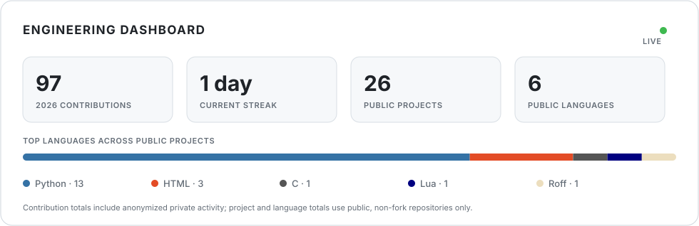

# Ives Liu

Electrical and Computer Engineering student at National Yang Ming Chiao Tung University (NYCU) in Taiwan.

I build end-to-end systems across digital hardware, embedded software, applied AI, and full-stack product engineering. I care about rigorous validation, reproducible tooling, and turning complex technology into software that people can actually use.

## Engineering dashboard

## Current focus

- FPGA and RTL development, simulation, synthesis, and cross-platform hardware toolchains
- Embedded systems and hardware–software integration with Rust and C
- Applied AI research platforms, evaluation pipelines, and educational tools
- Full-stack products, real-time applications, developer tooling, and deployment automation

## Selected open-source work

- **[TSIC FPGA Devkit](https://github.com/IvesLiu1026/tsic-fpga-devkit)** — A one-click, cross-platform development environment for TSIC Verilog labs and Tang Nano FPGA projects. It provides pinned toolchains, checksum verification, VS Code tasks, bilingual documentation, and CI validation for macOS and Windows.
- **[Adaptive Reasoning Prompting](https://github.com/IvesLiu1026/lrm-prompting-experiments)** — An experimental pipeline for studying how dynamic reasoning prompts affect large language models on MMLU, including parallel inference, result aggregation, and quantitative analysis.
- **[Question Generation from Video Transcripts](https://github.com/IvesLiu1026/QGProject)** — A local-LLM workflow for generating multiple-choice questions from educational video transcripts.

## Beyond open source

My other work includes a bare-metal Rust mini operating system for STM32F4 hardware, an AI-assisted video instruction and review platform, a real-time Rust and Flutter social game, and a full-stack course-authoring platform. These projects span firmware, interactive graphics, backend architecture, authentication, real-time communication, CI, and deployment.

## Technical toolkit

- **Hardware:** Verilog, FPGA simulation and synthesis, Gowin EDA, Icarus Verilog, Yosys, OSS CAD Suite
- **Systems:** Rust, C, embedded firmware, hardware–software integration
- **Applications:** Python, TypeScript, Dart, React, Next.js, Flutter
- **Backend and infrastructure:** FastAPI, Axum, PostgreSQL, WebSocket, Docker, Cloudflare
- **Engineering:** Git, GitHub Actions, automated testing, reproducible environments, deployment automation, technical writing

## Connect

- [LinkedIn](https://www.linkedin.com/in/liu-ives-92612a245/)
- [GitHub projects](https://github.com/IvesLiu1026?tab=repositories)
