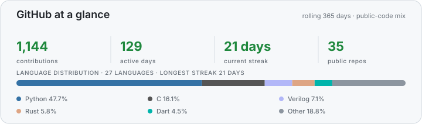

<h1 align="center">Hi, I'm Ives Liu</h1>

  NYCU NLP Lab · Controllable visual generation · Multimodal systems · 3D world generation

I have an Electrical and Computer Engineering background and have worked with the NYCU NLP Lab since 2024. My current research centers on VISTA and VISTA World.

## Research

- **[VISTA — Video Instruction Synthesis for Training AI](https://github.com/IvesLiu1026/VISTA)** — Controllable visual generation, multimodal experiments, and reproducible evaluation.
- **[VISTA World](https://github.com/IvesLiu1026/VISTA-World)** — Controllable 3D environment generation, informed by **[SimWorld Studio](https://github.com/IvesLiu1026/SimWorld-Studio)**.

Earlier work: **[adaptive reasoning prompting](https://github.com/IvesLiu1026/lrm-prompting-experiments)** · **[video-transcript question generation](https://github.com/IvesLiu1026/QGProject)** · embedded systems · FPGA/RTL.

## At a glance

  

Public-code distribution describes repository contents, not proficiency.

