<h1 align="center">Hi, I'm Ives Liu</h1>

  NYCU · NLP Lab

With an academic background in Electrical and Computer Engineering at NYCU, I joined the NYCU NLP Lab in 2024. I began by working on question answering and broader NLP tasks, and my research has since evolved toward controllable visual generation, multimodal systems, and 3D world generation. My current work centers on VISTA and VISTA World.

## Research

- **[VISTA — Video Instruction Synthesis for Training AI](https://github.com/IvesLiu1026/VISTA)** — My primary research system for controllable visual generation and multimodal experiments, with reproducible synthesis, review, and evaluation workflows.
- **VISTA World** — An ongoing research direction that integrates controllable 3D environment generation with VISTA, informed by the environment-generation ideas explored in **[SimWorld Studio](https://github.com/IvesLiu1026/SimWorld-Studio)**.

## Research snapshot

| | |
|---|---|
| **Current systems** | VISTA · VISTA World |
| **Research focus** | Controllable generation · Multimodal systems · 3D world generation |
| **NLP background** | Language models · Evaluation · Prompting · Data pipelines |
| **Research engineering** | Experiment tooling · Reproducible workflows · Interactive interfaces |

Earlier NLP experiments include **[adaptive reasoning prompting](https://github.com/IvesLiu1026/lrm-prompting-experiments)** and **[question generation from video transcripts](https://github.com/IvesLiu1026/QGProject)**.

Outside my primary research, I maintain a broader technical interest in embedded systems, FPGA/RTL development, hardware–software integration, and low-level firmware.

## Public-code language distribution

  

Calculated from public repositories; this is a code-distribution view, not a measure of proficiency or research impact.

## Connect

- [GitHub repositories](https://github.com/IvesLiu1026?tab=repositories)
